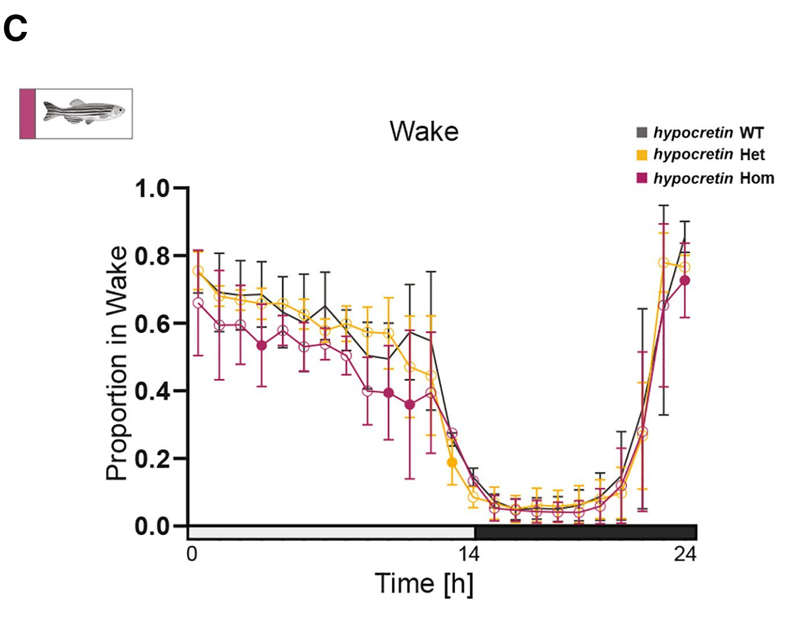
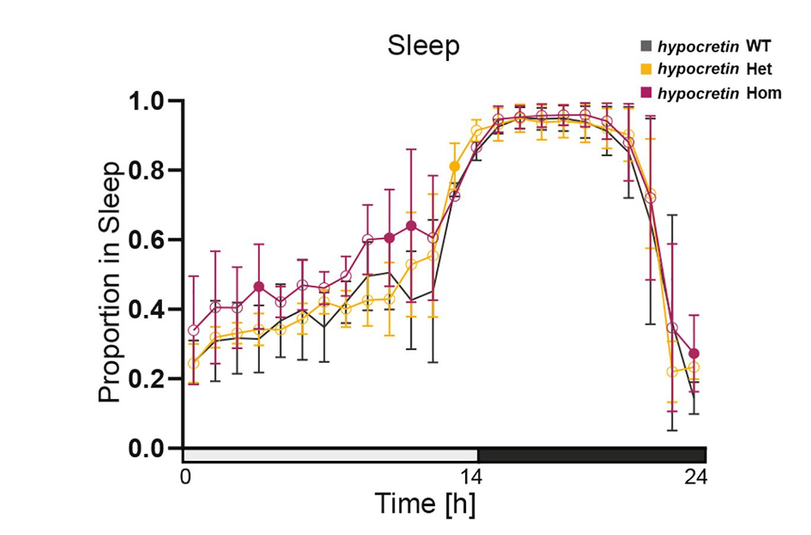

```{r setup, include=FALSE}
knitr::opts_chunk$set(echo = TRUE)
```

## Packages we will use

Packages contain useful scripts written by other people here sets the working directory ggplot2 creates plots

```{r packages}
#useful for creating plots
library(ggplot2)
#manipulating dates and time
library(lubridate)
#sets the working directory
library(here)
#various useful functions
library(tidyr)
library(dplyr)
#used to calculate the SEM
#install.packages("plotrix")
library(plotrix)
#change the scales on a timecourse plot
library(scales)
library(forcats)

#library(tidyverse)
```

##Section 1: Loading in the dataset

We will load in the data from the Bitsikas et al paper into a variable called fish_df. This is a subset of the total data and contains all the observations from the month of August.

```{r dataset}
fish_df <- read.csv(here("zebrafish_behaviour_subset.csv"))
#examine how the data is structured
str(fish_df)
```

We can see that this is a dataframe that contains the 869486 observations or rows

Each observation has a timepoint (time column), the distance travelled in 6 seconds (Dist_6s column), the genotype of the individual (genotype column), if the observation occured at day or night (daytime column) and the sleep-wake state of the individual (state column)

```{r dataset}
#look at the first 6 rows
head(fish_df)
#open the full dataframe in a new tab
View(fish_df)
```

## Section 2: Convert format of date-time column

Convert the time column to a date-time object using the function as_datetime() from lubridate

We can also use the day(), hour() and minute() functions to extract the day, hour and minute from the time

```{r convert times}
fish_df$time <- as_datetime(fish_df$time)
fish_df$day <- day(fish_df$time)
fish_df$hour <- hour(fish_df$time)
fish_df$minute <- minute(fish_df$time)
fish_df$second <- second(fish_df$time)
fish_df$timestamp <- paste(fish_df$hour, fish_df$minute, fish_df$second, sep = ":")
```

For the first plot, we will filter for just the wildtype (WT) data using the filter() function

This subsets the dataframe from 869,486 rows to 263,682 rows

```{r convert times}
fish_WT <- filter(fish_df, genotype == "WT")
```

## Section 3: Plotting the time series

```{r timecourse}
#plot the raw observations (264k observations, resolution = 6sec)
ggplot(fish_WT, aes(x = time, y = Dist_6s)) + geom_line() + ggtitle("Plot 1: Zerbafish time series over 4 days")
```

```{r timecourse}
#plot all observations for one day
fish_WT %>% filter(day == 10) %>% ggplot(., aes(x = time, y = Dist_6s)) + geom_line() + scale_x_datetime(breaks=date_breaks("6 hours")) + ggtitle("Plot 2: Zebrafish time series data over one day")

```

Compare this to the timecourse figure from the paper. Lights on occurs from 9:00:00 - 23:00:00 lights off occurs from 23:00:01 -8:59:59.


## Section 4: Determining sleep vs wake

Distance moved over time is used to make calls on if a fish is asleep or awake

```{r}
fish_wake <- fish_df %>% filter(state == "Wake") 
min(fish_wake$Dist_6s)
fish_sleep <- fish_df %>% filter(state == "Sleep") 
max(fish_sleep$Dist_6s)
```

We can see this cutoff when we plot the raw data as well

```{r}
fish_df %>% filter(day == 10) %>% ggplot(., aes(x = time, y = Dist_6s, colour = state)) + geom_line() + geom_point() + ggtitle("Plot 3: Zebrafish sleep vs wake speed over time")
```

And when we summarize the data with boxplots

```{r}
fish_df %>% filter(day == 10) %>% ggplot(., aes(y = Dist_6s, x = state)) + geom_boxplot(outlier.shape = NA) + geom_jitter(alpha = 0.2) + annotate("segment", x = 0.5, xend = 2.5, y = 0.2, yend = 0.2,linewidth = 2, colour = "red") + ggtitle("Plot 4: Zebrafish sleep vs wake cutoffs")
```

## Section 5: Comparison of sleep cycles in hypocretin knockouts vs wild type

```{r}
ggplot(fish_df, aes(x = hour, fill = state, colour = daytime)) + geom_histogram() + ggtitle("Plot 5: Total wake vs sleep observations in day vs night")
```

Plot the comparison across all hours

```{r}
fish_counts <- fish_df %>% count(hour, state, genotype)

#to get the total number of observations group by hour and genotype and then sum together all the sleep and wake observations
fish_counts <- fish_counts %>% select(hour, state, genotype, n) %>% group_by(hour, genotype) %>% mutate(totals = sum(n))

#divide the number of sleep and wake observations by the total number of observations
fish_counts$proportions <- fish_counts$n/fish_counts$totals

proportion_plot <- ggplot(fish_counts, aes(x = hour, y = proportions, color = genotype)) + geom_point() + geom_line() + facet_wrap(~state) + ggtitle("Plot 6: Sleep and wake proportions in wildtype vs knockouts")
proportion_plot

```

```{r}


```

 

Hypocretin knockout fish should have more daytime sleep than wild type.

```{r}
fish_counts %>% filter(hour %in% 9:23, genotype %in% c("WT", "Hom"))  %>% ggplot(., aes(x = state, y = mean_proportion, color = genotype)) + geom_boxplot() + ggtitle("Plot 7: Sleep and wake proportions in wildtype and knockouts during the day")

```

We only see this difference during the day and not during the night

```{r}
fish_counts %>% filter(hour %in% 0:8, genotype %in% c("WT", "Hom"))  %>% ggplot(., aes(x = state, y = mean_proportion, color = genotype)) + geom_boxplot() + ggtitle("Plot 8: Sleep and wake proportions in wildtype and knockouts during the night")
```

Uhmmm

```{r}
ggplot(fish_df, aes(x = hour, fill = state, colour = daytime)) + geom_histogram() + facet_wrap(~genotype) + ggtitle("Plot 10: Total wake vs sleep observations in day vs night by genotype")
```
