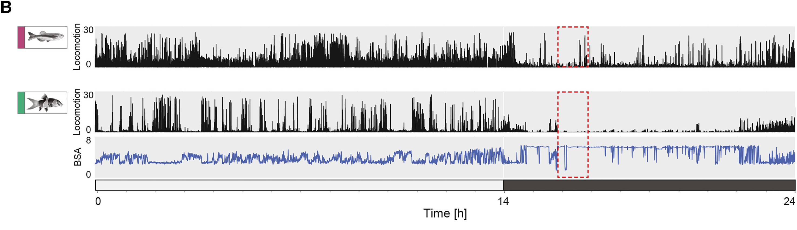

```{r setup, include=FALSE}
knitr::opts_chunk$set(echo = TRUE)
```

## Packages we will use

Packages contain useful scripts written by other people here sets the working directory ggplot2 creates plots

```{r packages}
#useful for creating plots
library(ggplot2)
#manipulating dates and time
library(lubridate)
#sets the working directory
library(here)
#various useful functions
#library(tidyr)
#library(dplyr)
#used to calculate the SEM
#install.packages("plotrix")
library(plotrix)
#change the scales on a timecourse plot
library(scales)
```

## Loading in the dataset

We will load in the data from the Bitsikas et al paper into a variable called fish_df. This is a subset of the total data and contains all the observations from the month of August.

```{r dataset}
fish_df <- read.csv(here("zebrafish_behaviour_subset.csv"))
#examine how the data is structured
str(fish_df)
```

We can see that this is a dataframe that contains the 869486 observations or rows

Each observation has a timepoint (time column), the unique individual being tracked (trackID column), the distance travelled in 6 seconds (column Dist_6s), the genotype of the individual (column genotype), if the observation occured at day or night (column daytime) and the sleep-wake state of the individual (column state)

```{r dataset}
#look at the first 6 rows
head(fish_df)
#open the full dataframe in a new tab
View(fish_df)
```

Each observation has a timepoint under the time column, the unique individual being tracked under the trackID column, the distance travelled in 6 seconds (column Dist_6s), the genotype of the individual

convert the time column to a date-time object using the function as_datetime() from lubridate we can also use the day(), hour() and minute() functions to extract the day, hour and minute from the time

```{r convert times}
fish_df$time <- as_datetime(fish_df$time)
fish_df$day <- day(fish_df$time)
fish_df$hour <- hour(fish_df$time)
fish_df$minute <- minute(fish_df$time)
```

For the first plot, we will filter for just the wildtype (WT) data This subsets the dataframe from 869,486 rows to 263,682 rows

```{r convert times}
fish_WT <- filter(fish_df, genotype == "WT")
```

#Plotting the timecourse

```{r timecourse}
#plot the raw observations (264k observations, resolution = 6sec)
ggplot(fish_WT, aes(x = time, y = Dist_6s)) + geom_line()
#plot all observations (264k), rounded to the nearest hour
ggplot(fish_WT, aes(x = round_date(time, unit = "hour"), y = Dist_6s)) + geom_line() 
```

```{r timecourse}
#plot all observations, rounded to the nearest hour for one day
fish_WT %>% filter(day == 11) %>% ggplot(., aes(x = time, y = Dist_6s)) + geom_line() + scale_x_time(breaks=date_breaks("6 hours"))

```

#compare this to the timecourse figure from the paper



```{r}

```
