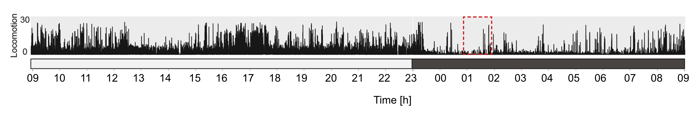
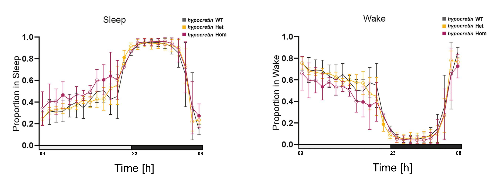

```{r setup, include=FALSE}
knitr::opts_chunk$set(echo = TRUE)
```

## Packages we will use

Packages are collections of useful functions, data and documentation written by other people as an extension of basic R features.

```{r packages}
# a collection of R packages including ggplot, lubridate, forcats, stringr, tidyr, dplyr
library(tidyverse)
#additional package that sets the working directory
library(here)
#additional package to change the scales on a time series plot
library(scales)
```

##Section 1: Loading in the dataset

We will load in the data from the Bitsikas et al paper into a variable called fish_df. This is a subset of the total data and contains all the observations from the month of August.

```{r Section 1.1}
fish_df <- read.csv(file = here("zebrafish_behaviour_subset.csv"))
#examine how the data is structured
str(fish_df)
```

We can see that this is a dataframe that contains the 869, 486 observations or rows.

Each observation has a timepoint (time column), the distance travelled in 6 seconds (Dist_6s column), the genotype of the individual (genotype column), if the observation occured at day or night (daytime column) and the sleep-wake state of the individual (state column).

```{r Section 1.2}
#look at the first 6 rows
head(fish_df)
```

## Section 2: Convert format of date-time column

We will convert the time column to a date-time object using the function as_datetime() from lubridate.

We can also use the day(), hour() and minute() functions to extract the day, hour and minute from the time.

```{r Section 2.1}
fish_df$time <- as_datetime(fish_df$time)
fish_df$day <- day(fish_df$time)
fish_df$hour <- hour(fish_df$time)
fish_df$minute <- minute(fish_df$time)
#fish_df$second <- second(fish_df$time)
#fish_df$timestamp <- paste(fish_df$hour, fish_df$minute, fish_df$second, sep = ":")
```

For the first plot, we will filter for just the wildtype (WT) data using the filter() function. We will call the subset dataframe fish_WT. This subsets the dataframe from 869,486 rows to 263,682 rows.

```{r Section 2.2}
fish_WT <- filter(fish_df, genotype == "WT")
```

## Section 3: Plotting the time series

The function ggplot allows us to create a customizable data visualizations It requires the data to plot as the first variable, and the aesthetics to be used when making the plot (typically this is the x and y coordinates). You can then specify the type of plot you want to make with additional mapping layers. Here we use geom_line() but we will go through other examples of plots supported by ggplot.

```{r Section 3.1}
#plot the raw observations (264k observations) from fish_WT
#set the x axis to be time and the y axis to be distance moved in 6s
ggplot(data = fish_WT, mapping = aes(x = time, y = Dist_6s)) + geom_line() + ggtitle("Plot 1: Zerbafish time series over 4 days")
```

We can look at the data from one day of observations. By using the pipe operator %\>% we can run this in one line. The pipe operator takes the output of one function and passes it to be the input of a second function and so on. First we pass the fish_WT dataframe to the filter() function and then pass the result of this (the filtered dataframe) to ggplot and create the same time series plot as above.

```{r Section 3.2}
#plot all observations for one day
fish_WT %>% filter(day == 12) %>% ggplot(., aes(x = time, y = Dist_6s)) + geom_line() + scale_x_datetime(breaks = date_breaks("2 hours")) + theme(axis.text.x = element_text(angle = 90)) + ggtitle("Plot 2: Zebrafish time series data over one day")

```

We can compare this to the time series figure from the paper. We can see on both days there is more activity during the day and less at night. \*\*Lights on occurs from 9:00:00 - 23:00:00 lights off occurs from 23:00:01 -8:59:59.



## Section 4: Determining sleep vs wake

Distance moved over time (speed) at any given time point is used to make calls on if a fish is asleep or awake. We can find what the cutoff they used is by looking at what the minimum speed they call wake is and what the maximum speed they call sleep is.

```{r Section 4.1}
fish_wake <- fish_df %>% filter(state == "Wake") 
min(fish_wake$Dist_6s)
fish_sleep <- fish_df %>% filter(state == "Sleep") 
max(fish_sleep$Dist_6s)
```

It appears the cutoff they use is 0.2cm/s. We can see this cutoff when we plot the raw data as well.

```{r Section 4.2}
ggplot(fish_df, aes(x = time, y = Dist_6s, colour = state)) + geom_line() + scale_colour_manual(values = c("lightseagreen" , "navy")) + ggtitle("Plot 3: Zebrafish sleep vs wake speed over time") 
```

And when we summarize the data with boxplots.

```{r Section 4.3}
fish_df %>% filter(day == 10) %>% ggplot(., aes(y = Dist_6s, x = state, colour = state)) + geom_jitter(alpha = 0.2) + annotate("segment", x = 0.5, xend = 2.5, y = 0.2, yend = 0.2,linewidth = 2, colour = "red") + scale_colour_manual(values = c("lightseagreen" , "navy")) + ggtitle("Plot 4: Zebrafish sleep vs wake cutoffs") 
```

## Section 5: Sleep timing in wildtype zebrafish

Zebrafish are diurnal; when we look at the total number of observations of sleep and wake, we can see that most sleep tends to occur during the night and most wake occurs during the day.

```{r Section 5.1}
ggplot(fish_WT, aes(x = hour, fill = state)) + annotate("rect", xmin = 0, xmax = 9, ymin = 0, ymax = Inf, fill = "grey", alpha = 0.6) + annotate("rect", xmin = 22.0, xmax = 23.9, ymin = 0, ymax = Inf, fill = "grey", alpha = 0.6) + geom_histogram(colour = "black", bins = 25) + scale_fill_manual(values = c("slateblue4", "lightseagreen" ))  + ggtitle("Plot 5: Total wake vs sleep observations in day vs night")
```

In wildtype zebrafish sleep is consolidated.

```{r Section 5.2}
fish_WT %>% filter(day == 10, hour %in% 0:8) %>% ggplot(., aes(x = time, fill = state)) + geom_bar(position = "fill") + scale_fill_manual(values = c("slateblue4", "lightseagreen" )) + scale_x_datetime(breaks = date_breaks("2 hours"))+ theme(axis.text.x = element_text(angle = 90))   + ggtitle("Plot 6: Zebrafish sleep")
```

## Section 6: Comparison of sleep cycles in hypocretin knockouts vs wild type

Plot the comparison across all hours

```{r Section 6.1}
fish_counts <- fish_df %>% count(hour, state, genotype)

#to get the total number of observations group by hour and genotype and then sum together all the sleep and wake observations
fish_counts <- fish_counts %>% select(hour, state, genotype, n) %>% group_by(hour, genotype) %>% mutate(totals = sum(n))

#divide the number of sleep and wake observations by the total number of observations
fish_counts$proportions <- fish_counts$n/fish_counts$totals

proportion_plot <- ggplot(fish_counts, aes(x = hour, y = proportions, color = genotype)) + annotate("rect", xmin = 0, xmax = 9, ymin = 0, ymax = Inf, fill = "grey", alpha = 0.6) + annotate("rect", xmin = 23, xmax = 24, ymin = 0, ymax = Inf, fill = "grey", alpha = 0.6) + geom_point() + geom_line() + facet_wrap(~state) + ggtitle("Plot 7: Sleep and wake proportions in wildtype vs knockouts")

proportion_plot  

```



Hypocretin knockout fish should have more daytime sleep than wild type.

```{r Section 6.2}
fish_counts %>% filter(hour %in% 9:23, genotype %in% c("WT", "Hom"))  %>% ggplot(., aes(x = state, y = n, color = genotype)) + geom_boxplot() + scale_colour_manual(values = c("#F8766D" , "#619CFF")) + ggtitle("Plot 8: Sleep and wake proportions in wildtype and knockouts during the day") 

```

We only see this difference during the day and not during the night

```{r Section 6.3}
fish_counts %>% filter(hour %in% 0:8, genotype %in% c("WT", "Hom"))  %>% ggplot(., aes(x = state, y = n, color = genotype)) + geom_boxplot() + scale_colour_manual(values = c("#F8766D" , "#619CFF")) + ggtitle("Plot 9: Sleep and wake proportions in wildtype and knockouts during the night")
```

```{r Section 6.4}
ggplot(fish_df, aes(x = hour, fill = state)) + annotate("rect", xmin = 0, xmax = 9, ymin = 0, ymax = Inf, fill = "grey", alpha = 0.6) + annotate("rect", xmin = 22.0, xmax = 23.9, ymin = 0, ymax = Inf, fill = "grey", alpha = 0.6) + geom_histogram(colour = "black", bins = 25) + scale_fill_manual(values = c("slateblue4", "lightseagreen" )) + facet_wrap(~genotype) + ggtitle("Plot 10: Total wake vs sleep observations in day vs night by genotype")
```

```{r Section 6.5}
fish_df %>% filter(day %in% c(10, 14, 19), hour %in% 0:8) %>% ggplot(., aes(x = time, fill = state)) + geom_bar(position = "fill") + scale_fill_manual(values = c("slateblue4", "lightseagreen" )) + scale_x_datetime(breaks = date_breaks("4 hours")) + facet_wrap(~genotype, ncol = 1, nrow = 3, scales = "free") + ggtitle("Plot 11: Zebrafish sleep is equally consolidated in wildtype as knockouts")
```
