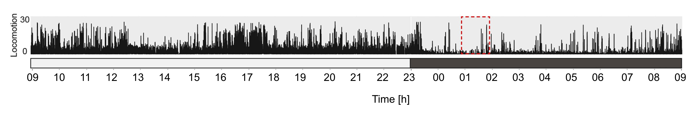
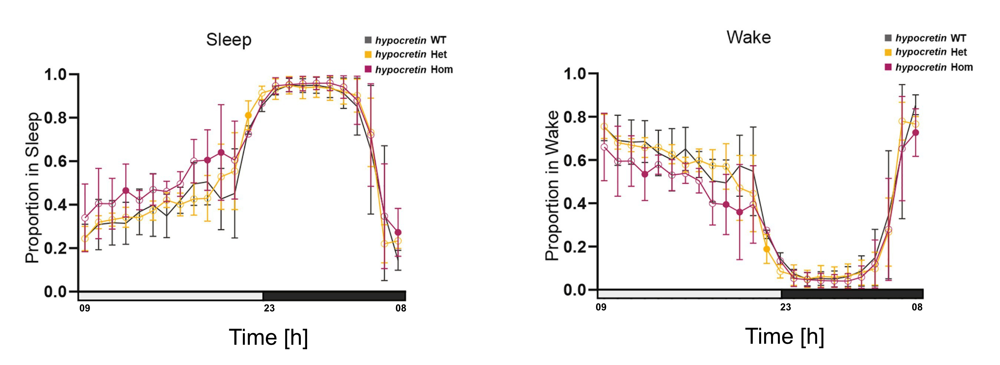

```{r setup, include=FALSE}
knitr::opts_chunk$set(echo = TRUE)
```

## Packages we will use

Packages are collections of useful functions, data and documentation written by other people as an extension of basic R features.

```{r packages}
# a collection of R packages including ggplot2, lubridate, forcats, stringr, tidyr, dplyr
install.packages("tidyverse")
library(tidyverse)
#additional package that sets the working directory
install.packages("here")
library(here)
#additional package to change the scales on a time series plot
install.packages("scales")
library(scales)
#additional package to calculate statistical significance
install.packages("ggpubr")
library(ggpubr)
```

##Section 1: Loading in the dataset

We will load in the data from the Bitsikas et al paper into a variable called fish_df. This is a subset of the total data and contains all the observations from the month of August.

```{r Section 1.1}
#Reads in the file as a dataframe
fish_df <- read.csv(file = here("zebrafish_behaviour_subset.csv"))

#Function that gives the structure of the data
str(fish_df)

#To learn more about what a function does, use the help function!
help(str)

#View the entire dataframe
View(fish_df)
```

We can see that this is a dataframe that contains the 869, 486 observations (rows) of five variables (columns)

Each observation has a timepoint (time column), the distance travelled in 6 seconds (Dist_6s column), the genotype of the individual (genotype column), if the observation occured at day or night (daytime column) and the sleep-wake state of the individual (state column).

```{r Section 1.2}
#Displays the first 6 rows
head(fish_df)

```

## Section 2: Convert format of date-time column

We will convert the time column to a date-time object using the function as_datetime() from lubridate.

We can also use the day(), hour() and minute() functions to extract the day, hour and minute from the time.

The \$ allows us to view and create new columns from our larger dataframe.

```{r Section 2.1}
#Convert the time column to a datetime object instead of a character
fish_df$time <- as_datetime(fish_df$time)

#Extract the day from the datetime as a new column
fish_df$day <- day(fish_df$time)

#Extract the hour from the datetime as a new column
fish_df$hour <- hour(fish_df$time)

#Extract the minute from the datetime as a new column
fish_df$minute <- minute(fish_df$time)

#We can see time is now a datetime object (POSIXct) and we've added 3 new columns
head(fish_df)
```

For the first plot, we will filter for just the wildtype (WT) data using the filter() function. We will call the subset dataframe fish_WT. This subsets the dataframe from 869,486 rows to 263,682 rows.

```{r Section 2.2}
#The filter function takes the data as a first argument and the filtering condition as the second argument
fish_WT <- filter(fish_df, genotype == "WT")

#We can see our dataframe is now much smaller
str(fish_WT)
```

## Section 3: Plotting the time series

The function ggplot allows us to create a customizable data visualizations. It requires the data to plot as the first variable, and the aesthetics to be used when making the plot (typically this is the x and y coordinates). You can then specify the type of plot you want to make with additional layers. Here we use geom_line() but we will go through other examples of plots supported by ggplot.

```{r Section 3.1}
#Plot the raw observations (264k observations) from fish_WT
#Set the x axis to be time and the y axis to be distance moved in 6s
time_series_plot <- ggplot(data = fish_WT, mapping = aes(x = ___, y = Dist_6s)) + #data and mapping
  geom_line() + #geom layer, plots each data point as a line
  ggtitle("Plot 1: Zebrafish time series over 4 days") #add a custom title

#Display the plot
time_series_plot
```

We can look at the data from one day of observations. By using the pipe operator %\>% we can run this in one line. The pipe operator takes the output of one function and passes it to be the input of a second function and so on. First we pass the fish_WT dataframe to the filter() function and then pass the result of this (the filtered dataframe) to ggplot and create the same time series plot as above.

```{r Section 3.2}
#Plot all observations for one day
single_day_plot <- fish_WT %>% filter(day == 12) %>% ggplot(., aes(x = time, y = Dist_6s)) + geom_line()

#Add two rectangles using annotate to show when day and night are occurring
single_day_plot <- single_day_plot +
  annotate("rect", xmin = as_datetime("2022-08-12 00:00:00"), xmax = as_datetime("2022-08-12 09:00:00"), ymin = 0, ymax = 7,  fill = "grey", alpha = 0.6)  +
  annotate("rect", xmin = as_datetime("2022-08-12 22:00:00"), xmax = as_datetime("2022-08-12 23:59:59"), ymin = 0, ymax = 7,  fill = "grey", alpha = 0.6) +
  geom_line()

#Manually change the x axis to have breaks every 2 hours
single_day_plot <- single_day_plot + scale_x_datetime(breaks = date_breaks("____"))

#Set the plot theme to one of the default themes
single_day_plot <- single_day_plot + theme_bw()

#Further customize the theme, rotate the x axis text 90°
single_day_plot <- single_day_plot + theme(axis.text.x = element_text(angle = 90)) 

#Add a title
single_day_plot <- single_day_plot + ggtitle("Plot 2: Zebrafish time series data over one day")

#Display the finished plot
single_day_plot
```

We can compare this to the time series figure from the paper. We can see on both days there is more activity during the \_\_\_ and less at \_\_\_.



## Section 4: Determining sleep vs wake

Distance moved over time (speed) at any given time point is used to make calls on if a fish is asleep or awake. We can find what the cutoff they used is by looking at what the minimum speed they call wake is and what the maximum speed they call sleep is.

```{r Section 4.1}
#Filter for wake observations and assign to a new dataframe
fish_wake <- fish_df %>% filter(state == "Wake") 

#What is the minimum wake speed?
min(fish_wake$Dist_6s)

#Filter for sleep observations and assign to a new dataframe
fish_sleep <- fish_df %>% filter(state == "Sleep") 

#What is the maximum sleep speed?
max(fish_sleep$Dist_6s)
```

It appears the cutoff they use is \_\_\_\_cm/s. We can see this cutoff when we plot the raw data as well.

```{r Section 4.2}
#Plot speed over time
speed_plot <- ggplot(fish_WT, aes(x = time, y = Dist_6s, colour = ___)) +
  geom_line()

#Manually set the colours we're using
speed_plot <- speed_plot + 
  scale_colour_manual(values = c("lightseagreen" , "navy"))

#Add a title
speed_plot <- speed_plot + ggtitle("Plot 3: Zebrafish sleep vs wake speed over time") 

#Display the plot
speed_plot
```

And when we plot the speed for each sleep and wake observation.

```{r Section 4.3}
#create a plot of sleep vs wake speeds
sleep_wake_plot <- fish_WT %>% #start with the wildtype dataframe
  filter(day == 10) %>% #filter to one day
  ggplot(., aes(y = Dist_6s, x = state, colour = state)) + #data and mapping
  geom_jitter(alpha = 0.2) #plot as a jittered point

#Add a red line using annotate to show the sleep/wake cutoff
sleep_wake_plot <- sleep_wake_plot + 
  annotate("segment", x = 0.5, xend = 2.5, y = ___, yend = ___,linewidth = 2, colour = "red") 

#Manually set the colours
sleep_wake_plot <- sleep_wake_plot + 
  scale_colour_manual(values = c("lightseagreen" , "navy")) 

#Add a title
sleep_wake_plot <- sleep_wake_plot +
  ggtitle("Plot 4: Zebrafish sleep vs wake cutoffs") 

#Display the plot
sleep_wake_plot
```

## Section 5: Sleep timing in wildtype zebrafish

Zebrafish are diurnal; when we look at the total number of observations of sleep and wake, we can see that most sleep tends to occur during the night and most wake occurs during the day.

```{r Section 5.1}
#Since we're making a histogram, we only need to set the x variable
total_counts_plot <- ggplot(fish_WT, aes(x = ___, fill = state)) #data and mapping

#Add two rectangles using annotate to show when day and night are occurring
total_counts_plot <- total_counts_plot + 
  annotate("rect", xmin = 0, xmax = 9, ymin = 0, ymax = Inf, fill = "grey", alpha = 0.6) + 
  annotate("rect", xmin = 22.0, xmax = 23.9, ymin = 0, ymax = Inf, fill = "grey", alpha = 0.6) 

#Plot the data as a histogram
total_counts_plot <- total_counts_plot + geom_histogram(colour = "black", bins = 25) 

#Manually set the colours
total_counts_plot <- total_counts_plot + 
  scale_fill_manual(values = c("slateblue4", "lightseagreen" )) +
  theme_bw()

#Add a title
total_counts_plot <- total_counts_plot +
  ggtitle("Plot 5: Total wake vs sleep observations in day vs night")

#Display the plot
total_counts_plot
```

## Section 6: Comparison of sleep cycles in hypocretin knockouts vs wildtype

We want to compare the proportion of time spent awake and the proportion of time spent asleep in the wildtype individuals vs the hypocretin knockouts.

To do this, we can use the group_by() function to group together all observations for a given set of variables. Here, we will group by three variables: hour (0-23), state (wake vs sleep) and genotype (wildtype, homozygous KO, heterozygous KO).

Then we pass this to the summarize() function which will perform a function on each group of observations and summarize the result of each into one row. Here, we are taking the total count of each group using n() but we could also take the mean(), median(), sd() and more.

This create a new dataframe with a column called n which contains the counts for each group.

```{r Section 6.1}
#Group and summarize the data to get the counts for each group
fish_counts <- fish_df %>%
  group_by(hour, state, _______) %>% #group by our variables of interest
  summarize(n = n()) #n() takes the total count for each group

head(fish_counts)
```

We now need to get the total number of sleep and wake observations in each genotype in each hour in order to later calculate the proportion of time spent in sleep and wake out of the total time observed. To do this we select the columns we need, then we group by only hour and genotype. This pools both the sleep and wake observations for each hour and each genotype. We can then sum together all the sleep and wake observations using mutate and the sum function. We then divide the number of sleep and wake observations by the total number of observations to get the proportions.

```{r Section 6.2}
fish_counts <- fish_counts %>% 
  group_by(_____, ______) %>% #group by hour and genotype (contains observations of sleep AND wake)
  mutate(proportions = n/sum(n)) #divide the number of observations in each state by the total observations

head(fish_counts)
```

We can now plot the proportion of total time spent in sleep and wake for each genotype over 24 hours.

```{r Section 6.3}
#Set the data and aesthetic mapping
proportion_plot <- ggplot(fish_counts, aes(x = hour, y = _______, color = genotype)) 

#Add two rectangles using annotate to show when day and night are occurring
proportion_plot <- proportion_plot + 
  annotate("rect", xmin = 0, xmax = 9, ymin = 0, ymax = Inf, fill = "grey", alpha = 0.6) + 
  annotate("rect", xmin = 23, xmax = 24, ymin = 0, ymax = Inf, fill = "grey", alpha = 0.6) 

#Set the geom layers to display the data
proportion_plot <- proportion_plot + 
  geom_point() + 
  geom_line() 

#Separate our plot by state using facet_wrap, making a separate panel for all Sleep and all Wake observations 
proportion_plot <- proportion_plot + 
  facet_wrap(~state) #make sure to use the ~ symbol!

#Add a default theme and custom title
proportion_plot <- proportion_plot + 
  theme_bw() + 
  ggtitle("Plot 6: Sleep and wake proportions in wildtype vs knockouts")

proportion_plot
```

The homozygous hypocretin knockouts have more daytime sleep than wild type, the same result as we see in the paper. 

When we look at the total counts (not the proportion) we can see the same result. There are more sleep observations in the daytime for the homozygous mutants compared to wildtype.

```{r Section 6.4}

genotype_counts_plot <- 
  ggplot(fish_df, aes(x = hour, fill = state)) + #set data and aesthetic mapping
  
  annotate("rect", xmin = 0, xmax = 9, ymin = 0, ymax = Inf, fill = "grey", alpha = 0.6) + #annotate night
  
  annotate("rect", xmin = 22.0, xmax = 23.9, ymin = 0, ymax = Inf, fill = "grey", alpha = 0.6) + #annotate night
  
  geom_histogram(colour = "black", bins = 25) + #geom layer 
  
  scale_fill_manual(values = c("slateblue4", "lightseagreen" )) + #set custom colours
  
  facet_wrap(~______) + #separate by our variable of interest
  
  theme_bw() + #add a default theme
  
  ggtitle("Plot 7: Total wake vs sleep observations in day vs night by genotype") #add a custom title

#Display plot
genotype_counts_plot
```

We can summarize this result with boxplots and use a t-test to determine if there is a statistically significant difference between the mean of each group.

First we will plot the observations from the daytime hours.

```{r Section 6.5}
daytime_boxplot <- fish_counts %>% 
  filter(hour %in% c(9:23), genotype %in% c("WT", "Hom")) %>% #filter for hour and genotype
  
  ggplot(., aes(x = state, y = ____, color = genotype)) + #data and aesthetic mapping
  
  geom_boxplot() + #geom layer displays data as a boxplot
  
  scale_colour_manual(values = c("#F8766D" , "#619CFF")) + #set custom colours
  
  facet_wrap(~state) + #separate by state
  
  stat_compare_means(method = "t.test") #function to perform a t-test 

  ggtitle("Plot 8: Sleep and wake observations in wildtype and knockouts during the day") #add a title

#Display the plot
daytime_boxplot

```

Next we will plot the observations from the nighttime hours.

```{r Section 6.6}
nighttime_boxplot <- fish_counts %>% 
  
  filter(hour %in% _____, genotype %in% c("WT", "Hom")) %>% #filter for hour and genotype
  
  ggplot(., aes(x = state, y = n, color = genotype)) + #data and aesthetic mapping

  geom_boxplot() + #geom layer displays data as a boxplot
  
  scale_colour_manual(values = c("#F8766D" , "#619CFF")) + #set custom colours
  
  facet_wrap(~state) + #separate by state

  stat_compare_means(method = "t.test") + #function to perform a t-test 

  ggtitle("Plot 9: Sleep and wake observations in wildtype and knockouts during the night") #add a title

#Display the plot
nighttime_boxplot
```

We can see there is a statistically significant effect only during the **\_\_\_\_** and not the **\_\_\_\_\_**.

The statistically significant effect is an \_\_\_\_\_\_\_ in sleep in the \_\_\_\_\_\_\_\_ genotype***, p value =*** **\_\_\_\_\_\_.**
